# Práctica 1 – Configuración del entorno de desarrollo móvil

Este repositorio contiene las evidencias de la instalación y configuración del entorno de desarrollo necesario para crear aplicaciones móviles, así como la ejecución de una aplicación de prueba utilizando **Flutter**.

---

# Integrantes del equipo

- Erickson
- Jorge Alberto Paniagua Escamilla
- Jose Alfredo Ramirez Aguirre

---

# Ejercicio 1 – Instalación del entorno de desarrollo

En este ejercicio se realizó la instalación y configuración de las herramientas necesarias para el desarrollo de aplicaciones móviles.

Las herramientas instaladas fueron:

- Android Studio
- Java Development Kit (JDK)
- Maven
- Git
- GitHub
- Node.js
- Flutter SDK

Posteriormente se ejecutó el siguiente comando en la terminal para verificar que todos los componentes estuvieran correctamente instalados:
Flutter doctor

Este comando permite comprobar que el entorno de desarrollo esté configurado correctamente para trabajar con Flutter.

Después de verificar la instalación, se creó una aplicación de prueba utilizando el siguiente comando:
flutter create hello_flutter

Finalmente, la aplicación fue ejecutada en el emulador de Android para comprobar que el entorno funciona correctamente.

---

# Evidencias

## Erickson

### Verificación del entorno con Flutter Doctor

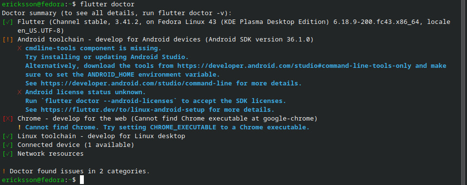

---

### Ejecución de la aplicación Hello Flutter en el emulador

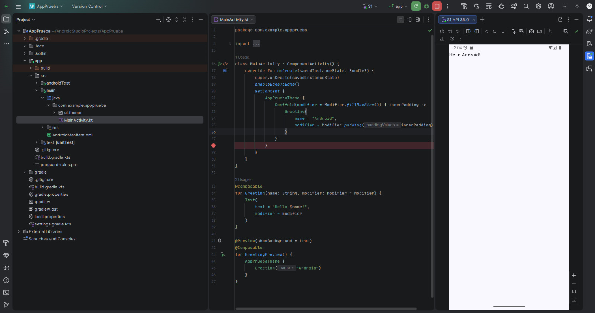

---

### Verificación de herramientas instaladas

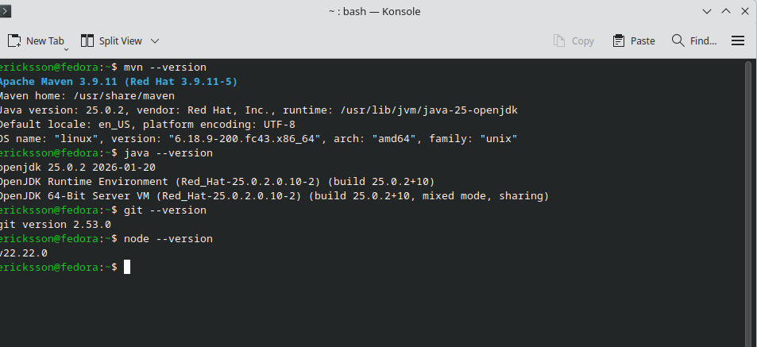

---

### Cuenta de GitHub utilizada

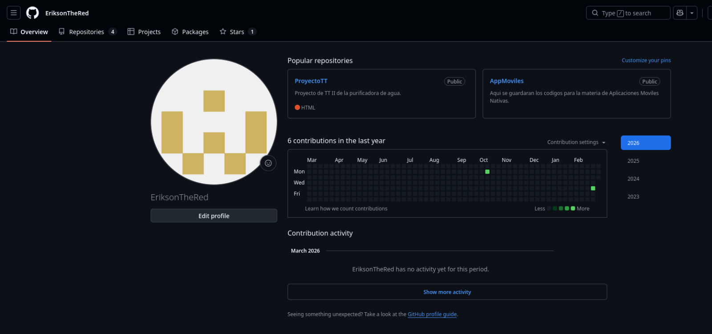

---

## Jorge Alberto Paniagua Escamilla

### Verificación del entorno con Flutter Doctor

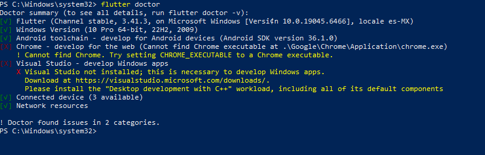

---

### Ejecución de la aplicación Hello Flutter en el emulador

---

### Verificación de herramientas instaladas

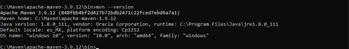

---

### Cuenta de GitHub utilizada

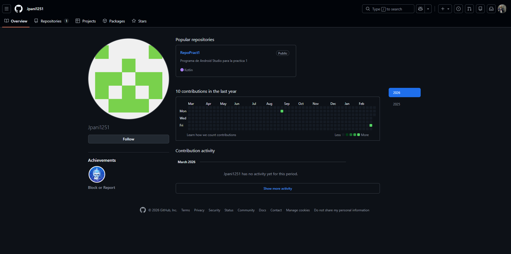

---

## Jose Alfredo Ramirez Aguirre

### Verificación del entorno con Flutter Doctor

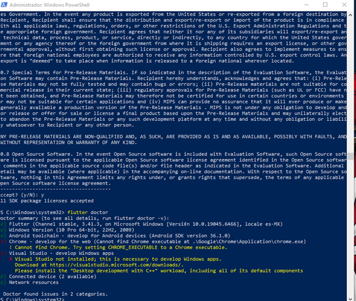

---

### Ejecución de la aplicación Hello Flutter en el emulador

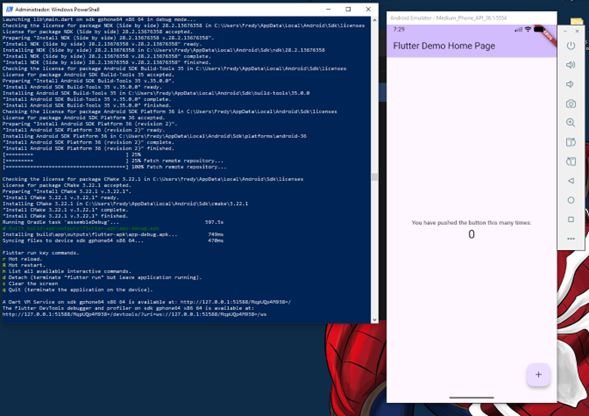

---

### Verificación de herramientas instaladas

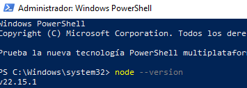

---

### Cuenta de GitHub utilizada

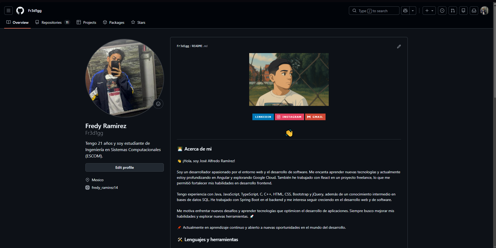

---
---

# Ejercicio 2 – Navegación Creativa

En este ejercicio se desarrolló una aplicación Android que implementa una navegación jerárquica entre diferentes **Activities**, representando distintos niveles de información relacionados con el sistema solar.

La aplicación permite al usuario navegar desde una vista general de la galaxia hasta información más específica sobre los planetas y sus lunas.

---

# Descripción de las Activities

## MainActivity (Vía Láctea)

Esta Activity funciona como el **menú principal de la aplicación**.  
Muestra una imagen representativa de la Vía Láctea y un botón que permite iniciar la exploración del sistema solar.

Desde esta pantalla el usuario puede acceder a la siguiente Activity del flujo de navegación.

---

## SistemaSolarActivity

En esta pantalla se presenta una **vista general del sistema solar**, incluyendo una imagen ilustrativa de los planetas orbitando alrededor del sol.

El usuario puede:

- Avanzar a la pantalla de **Planetas**
- Regresar al menú principal

---

## PlanetasActivity

Esta Activity muestra información visual sobre los **planetas del sistema solar** mediante una infografía.

Desde esta pantalla el usuario puede:

- Avanzar a la Activity de **Lunas**
- Regresar a la pantalla del **Sistema Solar**

---

## LunasActivity

Esta es la última pantalla de la navegación.  
Aquí se muestra información sobre las **lunas del sistema solar**, incluyendo una imagen representativa y una breve descripción.

El usuario puede regresar a la pantalla anterior utilizando el botón de regreso.

---

# Manejo de transiciones y ciclo de vida de Android

Para mejorar la experiencia de navegación se implementaron **animaciones personalizadas entre Activities**.

Las animaciones fueron definidas en archivos XML dentro de la carpeta: res/anim

Los archivos utilizados fueron:

- slide_in_right.xml
- slide_out_left.xml
- slide_in_left.xml
- slide_out_right.xml

Las transiciones se ejecutan mediante: ActivityOptions.makeCustomAnimation()
cuando se abre una nueva Activity.

Para manejar la navegación hacia atrás se utilizó: overridePendingTransition()
junto con:OnBackPressedDispatcher()
lo cual permite controlar el comportamiento del botón de regreso del sistema.

Además, en cada Activity se utilizó el método: onCreate()

que forma parte del **ciclo de vida de Android**, para inicializar la interfaz, configurar los botones y establecer la navegación entre pantallas.

---

# Instrucciones para ejecutar la aplicación

1. Clonar el repositorio:
git clone https://github.com/Jpani1251/RepoPract1.git

2. Abrir el proyecto en **Android Studio**.

3. Esperar a que Android Studio descargue las dependencias necesarias.

4. Ejecutar la aplicación presionando el botón **Run ▶**.

5. Seleccionar un **emulador Android** o un dispositivo físico conectado.

La aplicación iniciará mostrando el **menú principal de la Vía Láctea**.

---

# Capturas de pantalla de la aplicación

## Menú principal

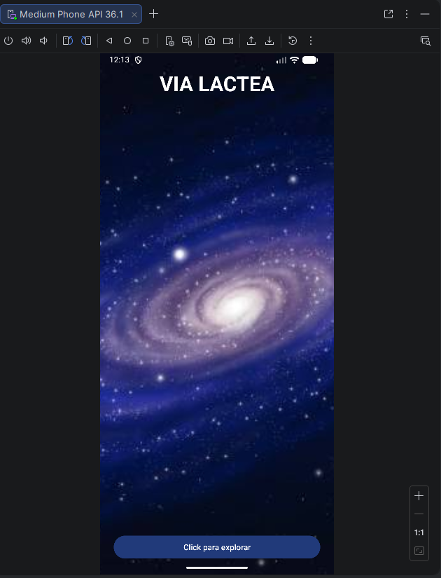

---

## Pantalla del Sistema Solar

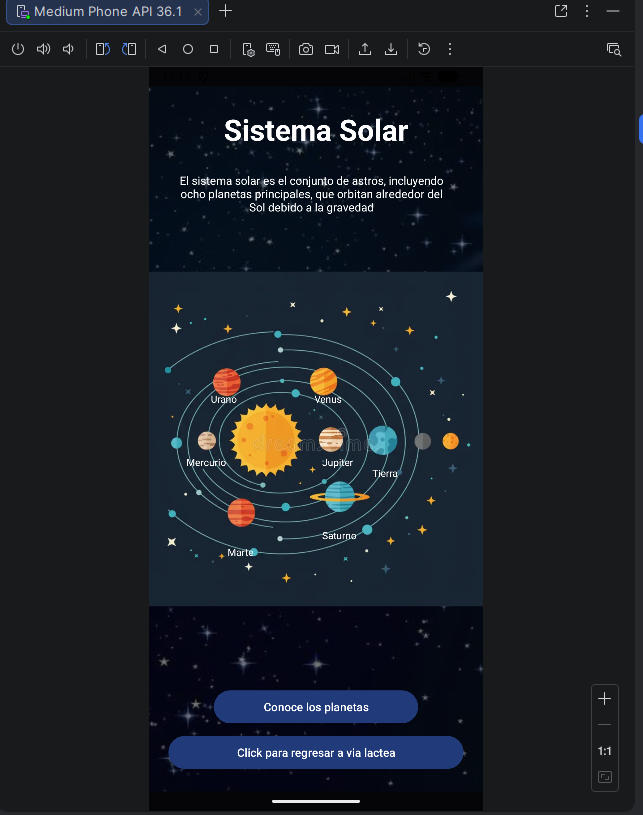

---

## Pantalla de Planetas

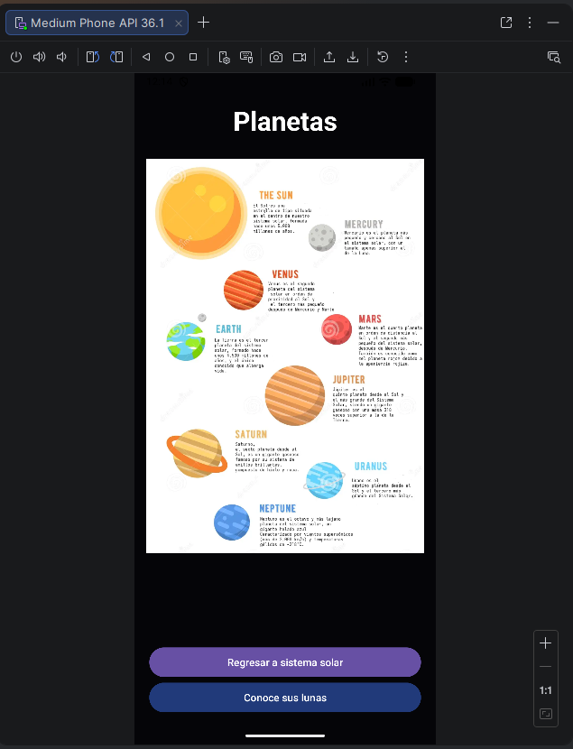

---

## Pantalla de Lunas

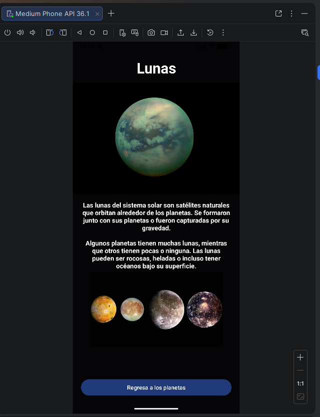

---

## Ejemplo de navegación entre pantallas

La aplicación permite navegar siguiendo la siguiente estructura:
Vía Láctea
↓
Sistema Solar
↓
Planetas
↓
Lunas

Cada transición entre pantallas utiliza animaciones

